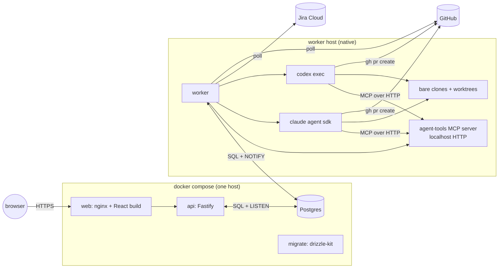
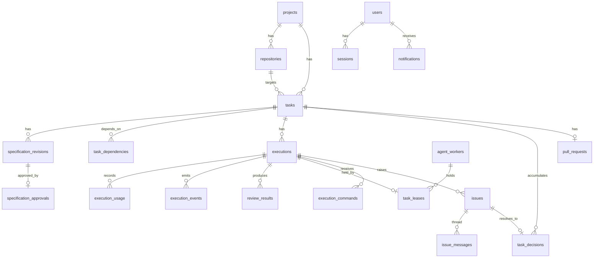
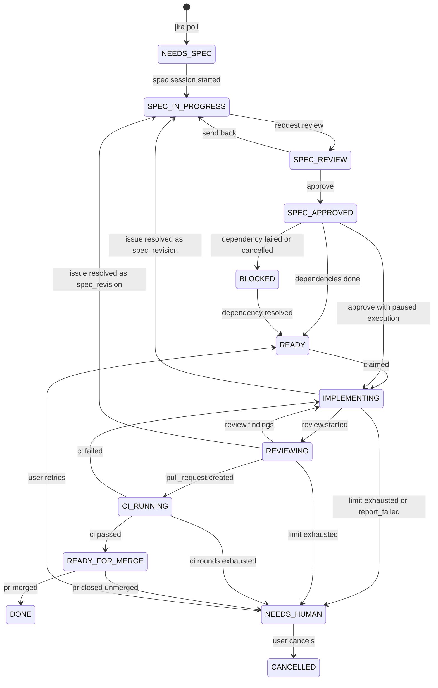
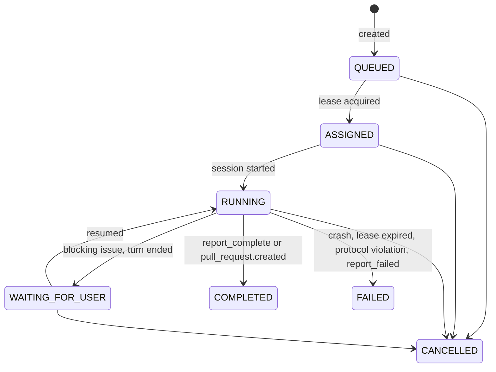

# Agent Orchestrator — Technical Design

Source: `Orchestration-layer-spec.v1.md`. This document describes how to build it. Where it departs from the spec, section 1.2 says so and why.

Decisions referenced as D1..D19 were settled before this document was written and are listed in Appendix A.

---

## 1. Purpose and boundaries

### 1.1 What this system does

Turns a Jira ticket into a reviewed pull request through four gates:

1. A human and a spec LLM produce a structured specification.
2. A human approves it.
3. The scheduler assigns the task to a coding agent on a worker host.
4. The agent implements, self-reviews with a fresh-context subagent, opens a PR, and CI runs.

A human returns only to approve a spec, answer an agent's question, intervene when automation stops, or merge.

### 1.2 Deviations from spec v1

| Spec section | Spec says | This design | Reason |
| --- | --- | --- | --- |
| §23, §24, §32 step 15 | Orchestrator launches a separate review execution after CI | Review is a phase inside the implementation execution, run by a fresh-context subagent before push. Order is implement → review loop → push → PR → CI. | D14. Mirrors the firstmate model. Keeps the fix loop inside one session with full context, and the reviewer still has no access to the implementer's transcript. |
| §23 | `ASSIGNED` is a task state | `ASSIGNED` is an execution state | D11. The task is `IMPLEMENTING` regardless of attempt number. |
| §23 | `WAITING_FOR_USER` is a task state | Execution state. The dashboard column is derived. | D11. A task with a paused execution and a queued retry has no single flat state. |
| §12 | Adapter has `send_message` | Adapter has `resume(sessionId, prompt)`. Messages are delivered by resuming a paused session. | D5. Sessions are not kept live between turns. |
| §22 | Several notification channels | In-app only | D19. |

### 1.3 Out of scope for MVP

Jira webhooks and status transitions. Email, Slack, browser push. Roles and permissions. Merge from the UI. More than one worker host (schema supports it). Spec templates per project. Reopening a `DONE` task. A dependency-editing UI beyond a list of ticket keys.

---

## 2. Topology



Process responsibilities:

| Process | Owns | Never does |
| --- | --- | --- |
| api | HTTP, auth, SSE fan-out, writing commands and state transitions requested by users | spawn agents, touch git, call Jira or GitHub |
| worker | Jira poll, GitHub poll, scheduler, leases, agent lifecycle, worktrees, sweeper, cost capture | serve HTTP to browsers |
| agent-tools | MCP endpoint agents call to report events, issues, results | reasoning of any kind |
| agent | investigate, code, test, self-review, git, PR | change task state directly |

Both api and worker talk only to Postgres. There is no api-to-worker RPC. The api writes rows into `execution_commands`, the worker consumes them. The worker writes `execution_events` and calls `NOTIFY`, the api streams them to browsers.

The worker runs natively because it spawns `claude` and `codex`, creates git worktrees, and runs each repository's own test toolchain. Those live on the host.

---

## 3. Repository layout

```
goopter_ticket_orchestra/
  package.json              pnpm workspace root
  pnpm-workspace.yaml
  docker-compose.yml        db, migrate, api, web
  .env.example
  apps/
    api/                    Fastify server
    worker/                 scheduler, pollers, agent runner, agent-tools server, sweeper
    web/                    React 19 + Vite
  packages/
    db/                     drizzle schema, migrations, typed queries
    core/                   state machines, transition function, domain types, event types
    adapters/               AgentAdapter interface, claude and codex implementations
    prompts/                system prompts and prompt assembly per role
    review-wrapper/         builds the `orchestra-review` binary put on the agent's PATH
  docs/
    design.md               this file
```

Package rules:

- `core` has no I/O. It exports the transition table and pure functions.
- `db` depends on `core` for enum types. Nothing else imports drizzle directly.
- `adapters` depends on nothing from `db`. It yields events, the worker persists them.
- `api` and `worker` are the only entry points.

---

## 4. Data model

### 4.1 Entity diagram



### 4.2 Tables

Types: `id` is `uuid` default `gen_random_uuid()`. Timestamps are `timestamptz`. Enums are Postgres enums generated from `packages/core`. JSON columns are `jsonb`.

**projects**

| column | type | notes |
| --- | --- | --- |
| id | uuid pk |  |
| key | text unique | Jira project key, e.g. `GOOP` |
| name | text |  |
| jira_jql | text | poll filter, e.g. `project = GOOP AND labels = agent-ready AND status != Done` |
| max_infra_retries | int default 3 | D13 |
| max_protocol_retries | int default 2 |  |
| max_ci_rounds | int default 3 |  |
| max_review_rounds | int default 3 |  |
| created_at | timestamptz |  |

**repositories**

| column | type | notes |
| --- | --- | --- |
| id | uuid pk |  |
| project_id | uuid fk |  |
| name | text | e.g. `goopter_odoo_modules` |
| git_url | text | ssh or https |
| default_branch | text |  |
| default_runtime | enum runtime | `claude` or `codex`, D18 |
| default_model | text nullable | runtime-specific model id |
| max_concurrent_worktrees | int default 1 | capacity, D7 |
| required_capability | text nullable | matched against `agent_workers.capabilities`, D16 |
| setup_command | text nullable | run once per fresh worktree, e.g. `pnpm install` |
| created_at | timestamptz |  |

Unique on `(project_id, name)`.

**tasks**

| column | type | notes |
| --- | --- | --- |
| id | uuid pk |  |
| project_id | uuid fk |  |
| repository_id | uuid fk nullable | set during spec building |
| jira_key | text unique | `GOOP-421` |
| jira_summary | text | refreshed on each poll |
| jira_priority | int | lower is more urgent |
| jira_created_at | timestamptz | age for scheduling |
| jira_synced_at | timestamptz |  |
| state | enum task_state | section 5.1 |
| runtime_override | enum runtime nullable | set at approval, D18 |
| approved_revision_id | uuid fk nullable | current contract |
| needs_human_reason | text nullable | set when entering `NEEDS_HUMAN` |
| created_at, updated_at | timestamptz |  |

Index on `(state)`, on `(repository_id, state)`.

**specification&#95;revisions**

| column | type | notes |
| --- | --- | --- |
| id | uuid pk |  |
| task_id | uuid fk |  |
| version | int | 1, 2, ... unique per task |
| status | enum revision_status | `draft`, `approved`, `superseded` |
| content | jsonb | schema in section 4.3 |
| created_by | uuid fk users nullable | null when produced by `propose_spec` |
| created_at, updated_at | timestamptz |  |

Unique on `(task_id, version)`. At most one row per task may be `draft` and at most one `approved`, enforced by partial unique indexes.

**specification&#95;approvals**

| column | type | notes |
| --- | --- | --- |
| id | uuid pk |  |
| revision_id | uuid fk unique |  |
| approved_by | uuid fk users |  |
| approved_at | timestamptz |  |
| runtime | enum runtime | runtime chosen at approval |

**task&#95;dependencies**

| column | type |
| --- | --- |
| task_id | uuid fk |
| depends_on_task_id | uuid fk |

Primary key on both. A check prevents `task_id = depends_on_task_id`. Cycles are rejected at insert by walking the graph in the api.

**executions**

| column | type | notes |
| --- | --- | --- |
| id | uuid pk |  |
| task_id | uuid fk |  |
| role | enum execution_role | `spec`, `implementation` |
| attempt | int | 1-based per task and role |
| state | enum execution_state | section 5.2 |
| runtime | enum runtime |  |
| model | text |  |
| spec_revision_id | uuid fk nullable | contract this execution runs against |
| worker_id | uuid fk nullable |  |
| host | text nullable | resume pinning, D5 |
| worktree_path | text nullable |  |
| branch | text nullable | `agent/GOOP-421-<short id>` |
| session_id | text nullable | Claude session id or Codex thread id |
| end_reason | enum end_reason nullable | section 9.5 |
| end_detail | text nullable |  |
| review_rounds | int default 0 |  |
| ci_rounds | int default 0 |  |
| infra_retries_used | int default 0 |  |
| input_tokens, cached_input_tokens, output_tokens | bigint default 0 | totals including review rounds |
| cost_usd | numeric(12,6) default 0 |  |
| worktree_evicted_at | timestamptz nullable |  |
| started_at, ended_at | timestamptz nullable |  |
| created_at | timestamptz |  |

Index on `(task_id, created_at)`, on `(state, host)`.

**execution&#95;usage**

One row per model turn or review round, for cost breakdown.

| column | type | notes |
| --- | --- | --- |
| id | uuid pk |  |
| execution_id | uuid fk |  |
| kind | enum usage_kind | `main`, `review`, `resume` |
| round | int nullable | review round number |
| runtime | enum runtime |  |
| model | text |  |
| input_tokens, cached_input_tokens, output_tokens | bigint |  |
| cost_usd | numeric(12,6) |  |
| recorded_at | timestamptz |  |

**task&#95;leases**

| column | type | notes |
| --- | --- | --- |
| id | uuid pk |  |
| task_id | uuid fk unique | one lease per task |
| execution_id | uuid fk |  |
| worker_id | uuid fk |  |
| acquired_at | timestamptz |  |
| expires_at | timestamptz | renewed on heartbeat, TTL 5 min |

**agent&#95;workers**

| column | type | notes |
| --- | --- | --- |
| id | uuid pk |  |
| host | text unique | hostname |
| capabilities | text[] | e.g. `{node,odoo,php}` |
| max_concurrent | int | slots |
| workspace_root | text |  |
| last_heartbeat_at | timestamptz |  |
| started_at | timestamptz |  |

**execution&#95;commands**

Queue from api to worker.

| column | type | notes |
| --- | --- | --- |
| id | uuid pk |  |
| task_id | uuid fk |  |
| execution_id | uuid fk nullable | null for `start_spec_session` |
| type | enum command_type | `start_spec_session`, `send_message`, `resume_with_decision`, `resume_with_revision`, `resume_with_ci_failure`, `cancel` |
| payload | jsonb |  |
| created_by | uuid fk users nullable |  |
| created_at | timestamptz |  |
| claimed_at | timestamptz nullable |  |
| completed_at | timestamptz nullable |  |

Index on `(claimed_at) where claimed_at is null`.

**issues**

| column | type | notes |
| --- | --- | --- |
| id | uuid pk |  |
| task_id | uuid fk |  |
| execution_id | uuid fk |  |
| type | enum issue_type | §15 list |
| severity | enum severity | `info`, `warning`, `blocking` |
| blocking | boolean |  |
| title | text |  |
| description | text |  |
| question | text nullable |  |
| suggested_options | jsonb nullable | `[{id, description, tradeoff}]` |
| recommended_option | text nullable |  |
| status | enum issue_status | `OPEN`, `RESOLVED`, `SUPERSEDED` |
| resolution_kind | enum resolution_kind nullable | `clarification`, `spec_revision`, D12 |
| resolution | text nullable |  |
| resolved_by | uuid fk users nullable |  |
| created_at, resolved_at | timestamptz |  |

Index on `(status, created_at)`.

**issue&#95;messages**

| column | type | notes |
| --- | --- | --- |
| id | uuid pk |  |
| issue_id | uuid fk |  |
| author_kind | enum author_kind | `agent`, `user` |
| user_id | uuid fk nullable |  |
| body | text |  |
| created_at | timestamptz |  |

**task&#95;decisions**

| column | type | notes |
| --- | --- | --- |
| id | uuid pk |  |
| task_id | uuid fk |  |
| issue_id | uuid fk unique |  |
| decision | text |  |
| clarification | text nullable |  |
| chosen_option | text nullable |  |
| decided_by | uuid fk users |  |
| decided_at | timestamptz |  |

**pull&#95;requests**

| column | type | notes |
| --- | --- | --- |
| id | uuid pk |  |
| task_id | uuid fk unique |  |
| execution_id | uuid fk |  |
| number | int |  |
| url | text |  |
| head_sha | text |  |
| state | enum pr_state | `open`, `merged`, `closed` |
| ci_state | enum ci_state | `pending`, `running`, `passed`, `failed` |
| ci_detail | jsonb nullable | failed check names and URLs |
| last_polled_at | timestamptz |  |
| created_at, merged_at | timestamptz |  |

**review&#95;results**

| column | type | notes |
| --- | --- | --- |
| id | uuid pk |  |
| execution_id | uuid fk |  |
| round | int |  |
| verdict | enum review_verdict | `clean`, `findings`, `ask_user` |
| findings | jsonb | `[{severity, file, line, description, action}]` |
| reviewer_runtime | enum runtime |  |
| usage_id | uuid fk execution_usage nullable |  |
| created_at | timestamptz |  |

**execution&#95;events**

Append-only. Everything the UI timeline shows.

| column | type | notes |
| --- | --- | --- |
| id | bigserial pk | ordering |
| task_id | uuid fk |  |
| execution_id | uuid fk nullable |  |
| type | text | section 9.6 |
| payload | jsonb |  |
| created_at | timestamptz |  |

Index on `(task_id, id)`. Rows older than 90 days for `DONE` tasks may be archived later, not in MVP.

**audit&#95;events**

| column | type | notes |
| --- | --- | --- |
| id | bigserial pk |  |
| entity_type | text | `task`, `execution`, `issue`, `revision` |
| entity_id | uuid |  |
| from_state | text nullable |  |
| to_state | text |  |
| trigger | text | event name from the transition table |
| actor_kind | enum actor_kind | `user`, `worker`, `agent`, `system` |
| actor_id | text nullable |  |
| created_at | timestamptz |  |

**users**

| column | type | notes |
| --- | --- | --- |
| id | uuid pk |  |
| email | citext unique |  |
| password_hash | text | argon2id |
| display_name | text |  |
| disabled_at | timestamptz nullable |  |
| created_at | timestamptz |  |

**sessions**

| column | type | notes |
| --- | --- | --- |
| id | uuid pk | value stored in cookie |
| user_id | uuid fk |  |
| expires_at | timestamptz | 30 days idle |
| created_at, last_seen_at | timestamptz |  |

**notifications**

| column | type | notes |
| --- | --- | --- |
| id | uuid pk |  |
| user_id | uuid fk nullable | null means all users |
| task_id | uuid fk |  |
| issue_id | uuid fk nullable |  |
| kind | enum notification_kind | `issue_raised`, `spec_review_requested`, `needs_human`, `ready_for_merge`, `execution_failed` |
| title | text |  |
| read_at | timestamptz nullable |  |
| created_at | timestamptz |  |

### 4.3 Specification content schema

Stored in `specification_revisions.content`. Validated with zod in `packages/core`.

```ts
type SpecContent = {
  repository: string;            // repositories.name
  objective: string;
  scope: string[];
  out_of_scope: string[];
  requirements: string[];
  acceptance_criteria: string[];
  validation: string[];
  constraints: string[];
  dependencies: string[];        // Jira keys, mirrored into task_dependencies on approval
  risks?: string[];
  notes?: string;
};
```

Approval requires `repository` to resolve and every list except `risks` and `dependencies` to be non-empty. An empty `dependencies` list means the task depends on nothing and is promoted straight to `READY`.

---

## 5. State machines

Both machines live in `packages/core/src/state.ts` as a table of `(from, trigger) → to`. The single function `transition(entity, trigger, actor)` validates the move, updates the row, writes `audit_events`, and calls `NOTIFY`. Nothing else writes `state`.

### 5.1 Task lifecycle



Any state except `DONE` may go to `CANCELLED` by user action. `FAILED` is reserved for a task whose Jira ticket disappears or whose repository is deleted.

Derived dashboard columns:

| Column | Condition |
| --- | --- |
| Needs Spec | `NEEDS_SPEC` |
| Spec In Progress | `SPEC_IN_PROGRESS` |
| Awaiting Spec Approval | `SPEC_REVIEW` |
| Ready | `SPEC_APPROVED`, `READY`, `BLOCKED` |
| Implementing | `IMPLEMENTING`, `REVIEWING` with no execution in `WAITING_FOR_USER` |
| Waiting for You | any state with an execution in `WAITING_FOR_USER` |
| CI | `CI_RUNNING` |
| Ready for Merge | `READY_FOR_MERGE` |
| Needs Human | `NEEDS_HUMAN` |
| Done | `DONE`, `CANCELLED` |

### 5.2 Execution lifecycle



An implementation execution is `COMPLETED` once the PR exists. CI feedback resumes the same execution rather than creating a new one, so the execution goes `COMPLETED → RUNNING` on `resume_with_ci_failure`. This is the one backward edge and is listed explicitly in the transition table.

A spec execution is `COMPLETED` when the user requests review. Sending the spec back to draft resumes it.

### 5.3 Transition table excerpt

| entity | from | trigger | to | actor | side effects |
| --- | --- | --- | --- | --- | --- |
| task | READY | `task.claimed` | IMPLEMENTING | worker | create execution, lease |
| task | IMPLEMENTING | `review.started` | REVIEWING | agent |  |
| task | REVIEWING | `review.findings` | IMPLEMENTING | agent | `review_rounds++`, check limit |
| task | REVIEWING | `pull_request.created` | CI_RUNNING | agent | insert `pull_requests`, execution `COMPLETED` |
| task | CI_RUNNING | `ci.failed` | IMPLEMENTING | worker | `ci_rounds++`, enqueue `resume_with_ci_failure` |
| task | * | `issue.raised.blocking` | unchanged | agent | execution → `WAITING_FOR_USER` after turn end, notification |
| task | * | `issue.resolved.clarification` | unchanged | user | enqueue `resume_with_decision` |
| task | IMPLEMENTING or REVIEWING | `issue.resolved.spec_revision` | SPEC_IN_PROGRESS | user | new draft revision, execution stays `WAITING_FOR_USER` |
| task | SPEC_APPROVED | `spec.approved` with paused execution | IMPLEMENTING | user | enqueue `resume_with_revision` |
| task | SPEC_APPROVED | `spec.approved` no execution | READY or BLOCKED | user | dependency check |

The full table is code, in `packages/core/src/transitions.ts`, and is the reference for every edge above.

---

## 6. Scheduler

Runs inside the worker on a 5 second tick. Each tick does the following, in order.

### 6.1 Consume commands

```sql
UPDATE execution_commands
SET claimed_at = now()
WHERE id IN (
  SELECT id FROM execution_commands
  WHERE claimed_at IS NULL
    AND (execution_id IS NULL OR execution_id IN (
      SELECT id FROM executions WHERE host = $host OR host IS NULL))
  ORDER BY created_at
  FOR UPDATE SKIP LOCKED
  LIMIT 10)
RETURNING *;
```

Commands targeting an execution pinned to another host are left alone. If that host's worker has not heartbeated for 15 minutes, the sweeper (6.6) clears `host` so any worker may take the command with a fresh session.

### 6.2 Promote approved tasks

For every task in `SPEC_APPROVED` with no paused execution, if all rows in `task_dependencies` point at `DONE` tasks, transition to `READY`. If any points at `FAILED` or `CANCELLED`, transition to `BLOCKED`.

### 6.3 Claim

Only if this worker has a free slot.

```sql
WITH busy AS (
  SELECT t.repository_id, count(*) AS n
  FROM executions e JOIN tasks t ON t.id = e.task_id
  WHERE e.host = $host AND e.state IN ('ASSIGNED','RUNNING')
  GROUP BY t.repository_id
)
SELECT t.id
FROM tasks t
JOIN repositories r ON r.id = t.repository_id
LEFT JOIN busy ON busy.repository_id = r.id
WHERE t.state = 'READY'
  AND (r.required_capability IS NULL OR r.required_capability = ANY($capabilities))
  AND coalesce(busy.n, 0) < r.max_concurrent_worktrees
ORDER BY t.jira_priority ASC, t.jira_created_at ASC
FOR UPDATE OF t SKIP LOCKED
LIMIT 1;
```

In the same transaction: insert `executions` with `state = ASSIGNED`, insert `task_leases`, transition task to `IMPLEMENTING`. Commit. Then hand the execution to the agent runner (section 9). This is the atomic assignment §10 asks for.

Ordering is deterministic: dependency readiness is a precondition, then priority, then age. Repository capacity is a filter.

### 6.4 Heartbeat and lease renewal

Every 30 seconds the runner updates `task_leases.expires_at = now() + 5 min` for each live execution and `agent_workers.last_heartbeat_at`. Renewal is driven by the runner loop, not by the agent, so a hung agent still holds its lease until the runner's own liveness check (9.4) decides it is dead.

### 6.5 Lease sweeper

Every tick: any `task_leases` row with `expires_at < now()` whose execution is `ASSIGNED` or `RUNNING` means a dead worker. Transition the execution to `FAILED` with `end_reason = lease_expired`, delete the lease, and apply the retry policy (9.5). The worktree stays on the dead host. The retry creates a fresh execution with `host = NULL`, which any worker may claim and which starts from a fresh worktree of the pushed branch if one exists, else from the base branch.

### 6.6 Worktree sweeper

Hourly. Rules in order:

| Condition | Action |
| --- | --- |
| task `DONE` or `CANCELLED`, execution ended > 24h ago | remove worktree and local branch |
| execution `FAILED`, no retry pending, ended > 24h ago | remove worktree and local branch |
| execution `WAITING_FOR_USER` or task `NEEDS_HUMAN`, idle > 14 days | push branch if ahead of remote, remove worktree, set `worktree_evicted_at` |
| disk usage of `workspace_root` > `WORKER_DISK_HIGH_WATER_PCT` | evict oldest eligible from the third rule first, then second, until below threshold |

Resume of an evicted execution creates a new worktree from the remote branch before starting the session. The session id is still valid because session storage is separate from the worktree.

---

## 7. Agent adapter

`packages/adapters/src/types.ts`:

```ts
export interface StartRequest {
  cwd: string;
  systemPrompt: string;
  prompt: string;
  model?: string;
  allowedTools: ToolPolicy;           // 'implementation' | 'spec' | 'review'
  mcp: { url: string; token: string };
  env: Record<string, string>;
  maxBudgetUsd?: number;
}

export interface ResumeRequest extends Omit<StartRequest, 'systemPrompt'> {
  sessionId: string;
}

export type AgentEvent =
  | { type: 'session'; sessionId: string }
  | { type: 'text'; delta: string }
  | { type: 'tool_call'; name: string; input: unknown }
  | { type: 'tool_result'; name: string; ok: boolean }
  | { type: 'usage'; model: string; input: number; cached: number; output: number; costUsd?: number }
  | { type: 'turn_done'; finalText: string }
  | { type: 'error'; message: string; retriable: boolean };

export interface AgentAdapter {
  readonly runtime: 'claude' | 'codex';
  start(req: StartRequest, signal: AbortSignal): AsyncIterable<AgentEvent>;
  resume(req: ResumeRequest, signal: AbortSignal): AsyncIterable<AgentEvent>;
  canResume(sessionId: string, cwd: string): Promise<boolean>;
}
```

Cancel is the `AbortSignal`. Status is the event stream. Result is the `turn_done` event plus whatever the agent reported through agent-tools.

### 7.1 Claude adapter

Uses `@anthropic-ai/claude-agent-sdk`.

| concern | implementation |
| --- | --- |
| start | `query({ prompt, options: { cwd, systemPrompt, model, mcpServers: { orchestra: { type: 'http', url, headers: { Authorization } } }, allowedTools, permissionMode: 'bypassPermissions', maxBudgetUsd, env } })` |
| resume | same with `resume: sessionId` |
| session id | from the `system` init message |
| usage | `result` message: `total_cost_usd`, `usage`, `modelUsage` |
| text | `assistant` messages, text blocks |
| review subagent | native `Agent` tool is allowed, but the instructions tell the agent to use `orchestra-review` so both runtimes share one path |
| tool policy `spec` | `Read, Glob, Grep, Bash(git log:*), Bash(git show:*), mcp__orchestra__propose_spec, mcp__orchestra__raise_issue` |
| tool policy `implementation` | all built-ins plus `mcp__orchestra__*` |
| tool policy `review` | `Read, Glob, Grep, Bash(git diff:*), Bash(git log:*)`, plus the repository's test command |

### 7.2 Codex adapter

Spawns the `codex` CLI. Verified against the Codex docs: `codex exec --json` emits JSONL, `codex exec resume <thread_id>` resumes, `turn.completed` carries `usage`, MCP servers come from config.

| concern | implementation |
| --- | --- |
| start | `codex exec --json --sandbox workspace-write --skip-git-repo-check -C <cwd> -c 'mcp_servers.orchestra.url="<url>"' -c 'mcp_servers.orchestra.bearer_token_env_var="ORCHESTRA_TOKEN"' -` with prompt on stdin. System prompt is prepended to the user prompt because `exec` has no separate system channel. |
| resume | `codex exec resume <thread_id> --json -` |
| session id | `thread.started.thread_id` |
| usage | `turn.completed.usage`, priced by the worker (section 9.7) |
| text | `item.completed` where item type is `agent_message` |
| review subagent | `orchestra-review` on PATH, same as Claude |
| tool policy | Codex has no per-tool allow list. `spec` and `review` roles run with `--sandbox read-only`. `implementation` runs `workspace-write`. Network access for `gh` and `git push` requires the sandbox to permit it; set `-c sandbox_workspace_write.network_access=true`. |

Open item: confirm the exact `-c` key names for a streamable HTTP MCP server with bearer token in the installed Codex version before building. The mechanism is documented, the key names were not verified against a local install.

### 7.3 Choosing the adapter

`executions.runtime = tasks.runtime_override ?? repositories.default_runtime`. Spec executions use the repository default. The worker refuses to claim a task whose runtime binary is not on its PATH and logs a warning, so a Codex task waits for a Codex-capable worker rather than failing.

---

## 8. Agent-tools MCP server

One streamable HTTP MCP server per worker process, bound to `127.0.0.1:${WORKER_TOOLS_PORT}`. Started with the worker. Every request carries `Authorization: Bearer <execution token>`. The token is a random 32-byte value stored on the execution row as a hash, issued at start or resume, and revoked when the execution leaves `RUNNING`.

Using HTTP rather than a stdio child per execution means one server, one code path for both runtimes, and the `orchestra-review` wrapper can use the same endpoint.

Tools. All take and return JSON validated by zod schemas in `packages/core`.

| tool | roles | input | effect |
| --- | --- | --- | --- |
| `raise_issue` | all | `type, severity, blocking, title, description, question?, options?, recommended_option?` | insert `issues`, event `issue.created`, notification. If blocking, mark execution `blocking_pending` and return `{ issue_id, instruction: "Stop now. End your turn without further work. You will be resumed with the answer." }` |
| `report_review_started` | implementation | `round` | event `review.started`, task → `REVIEWING` |
| `report_review_result` | implementation | `round, verdict, findings[]` | insert `review_results`, event. `findings` → task `IMPLEMENTING`. `ask_user` findings must be followed by `raise_issue`. If `round > max_review_rounds`, return an instruction to stop and call `report_failed`. |
| `report_pr_created` | implementation | `url, number, head_sha` | insert `pull_requests`, event, task → `CI_RUNNING`, execution → `COMPLETED` |
| `report_complete` | spec | `summary` | used by spec role only when the user has finished; implementation completion is `report_pr_created` |
| `report_failed` | all | `reason, detail` | execution → `FAILED` with `end_reason = agent_gave_up`, task → `NEEDS_HUMAN` |
| `propose_spec` | spec | `SpecContent` | validate, upsert the task's draft revision, event `spec.proposed` |
| `note` | all | `text` | event `agent.note` for the timeline. Non-blocking observations that do not warrant an issue. |

Every call also renews the lease and writes an `execution_events` row.

A blocking `raise_issue` does not kill the session. It sets a flag. When the adapter yields `turn_done`, the runner sees the flag and moves the execution to `WAITING_FOR_USER`. If the turn has not ended 90 seconds after a blocking raise, the runner aborts the session and still moves to `WAITING_FOR_USER`. Resume then works from the last persisted turn.

---

## 9. Execution lifecycle

### 9.1 Worktree preparation

```
<workspace_root>/repos/<repository.name>.git     bare mirror, fetched before each start
<workspace_root>/work/<execution.id>/            worktree
```

Start of an implementation execution:

1. `git -C repos/X.git fetch --prune`
2. `git -C repos/X.git worktree add work/<id> -b agent/<KEY>-<short> origin/<default_branch>`
3. Run `repositories.setup_command` if set. Failure is an infrastructure failure.
4. Write `.orchestra/context.json` into the worktree with task, spec, decisions, and the review command. Git-ignored via `.git/info/exclude`.

Resume after eviction: same, but the branch is created from `origin/agent/<KEY>-<short>`.

Spec executions use a read-only worktree of the default branch under `work/<id>` too, removed when the spec is approved.

### 9.2 Prompt assembly

`packages/prompts` builds two strings per role.

System prompt, static per role, covers:

- who the agent is and what it may not do (no product decisions, no editing the spec, no force push, no merging)
- the agent-tools contract: when to call which tool, that a blocking `raise_issue` means stop
- the review protocol for the implementation role: after tests pass, run `orchestra-review`, read its findings JSON, fix valid findings, add a regression test per fixed finding, run it again, repeat until `clean` or the tool says stop, then commit, push, `gh pr create`, and call `report_pr_created`
- if the repository has `no-mistakes` initialized, run that pipeline instead of the manual review loop and report each of its review rounds through `report_review_result`
- the resume contract: on resume, the prompt begins with a header saying what happened since the last turn

User prompt, assembled per start or resume:

```
## Ticket
GOOP-421: <summary>
<description>
<comments>

## Approved specification (revision 2)
<SpecContent rendered as markdown>

## Decisions recorded on this task
- issue_784: Receipt language is device-local. Clarification: reinstall resets it. (user@ on 2026-09-20)

## Repository
name, default branch, working branch, setup command, test command

## Instructions
<role-specific>
```

Resume prompts prepend one of:

- `## Answer to your issue <id>` with the decision, clarification, and chosen option
- `## Specification revised to version N` with a unified diff of the rendered spec, and an instruction to reconcile work already done
- `## CI failed on <sha>` with failing check names, log excerpts up to 200 lines each, and round count
- `## Message from the user` for conversation turns on an open issue

### 9.3 Runner loop

One async task per live execution.

```
prepare worktree
issue execution token
events = adapter.start(...) or adapter.resume(...)
for event of events:
  session      → store session_id
  text         → buffer, flush to execution_events as agent.message.delta every 200ms
  tool_call    → execution_events agent.tool_call
  usage        → execution_usage row, add to execution totals
  error        → classify, break
  turn_done    → break
if blocking_pending      → WAITING_FOR_USER
elif execution COMPLETED → done (report_pr_created happened)
elif execution FAILED    → done (report_failed happened)
elif role = spec         → stay RUNNING, wait for next command
else                     → protocol violation (9.5)
revoke token
```

Spec role sessions differ: each user message is a resume with the message as prompt, and the execution stays `RUNNING` between turns because the user is actively working. It goes `COMPLETED` on request-review and is resumed if the spec is sent back.

Issue conversation (§19): a `send_message` command on an execution in `WAITING_FOR_USER` resumes the session with the message. The runner captures the agent's final text into `issue_messages` with `author_kind = agent` and returns the execution to `WAITING_FOR_USER`, because the issue is still open. Resolving the issue is the only way out.

### 9.4 Liveness

The runner considers a session dead when no event has arrived for `AGENT_QUIET_TIMEOUT` (default 20 minutes). It aborts, classifies as `agent_hung`, which is an infrastructure failure. Long test suites should use `setup_command` and the test command's own output to keep events flowing.

### 9.5 Failure classification and retry

Decided by the runner from how the execution ended, never from agent prose.

| end_reason | class | next |
| --- | --- | --- |
| `adapter_error` retriable, `process_crash`, `lease_expired`, `agent_hung`, `setup_failed` | infrastructure | `infra_retries_used < max_infra_retries` → new execution, backoff `30s * 2^n`, resume session if `canResume` else fresh. Otherwise `NEEDS_HUMAN`. |
| `adapter_error` not retriable (auth, quota, bad model) | infrastructure, terminal | `NEEDS_HUMAN` immediately, reason in `needs_human_reason` |
| `protocol_violation` (turn ended with no terminal tool call and no blocking issue) | protocol | up to `max_protocol_retries`, resume with a nudge prompt naming the missing call. Then `NEEDS_HUMAN`. |
| `agent_gave_up` (`report_failed`) | business | `NEEDS_HUMAN`, no retry |
| `budget_exceeded` | business | `NEEDS_HUMAN` |
| `cancelled` | user | none |

CI and review round limits are enforced at the transition (5.3), not here.

`NEEDS_HUMAN` has two user actions: retry, which creates a fresh execution from `READY` with a fresh worktree from the pushed branch, or cancel.

### 9.6 Event types

Written to `execution_events.type`. Superset of spec §27.

```
execution.queued  execution.assigned  execution.started  execution.resumed
execution.heartbeat  execution.waiting  execution.completed  execution.failed
execution.cancelled  worktree.prepared  worktree.evicted
agent.message.delta  agent.message  agent.tool_call  agent.note
spec.proposed  spec.review_requested  spec.approved  spec.sent_back  spec.revised
issue.created  issue.message  issue.resolved
review.started  review.result
pull_request.created  ci.started  ci.failed  ci.passed  pull_request.merged  pull_request.closed
task.state_changed  usage.recorded
```

`task.state_changed` is written by `transition()` for every task move, so the timeline can render state changes inline.

### 9.7 Cost capture

- Claude: the `result` message carries `total_cost_usd` and per-model usage. Recorded as-is.
- Codex: each `turn.completed.usage` is priced with `config/pricing.json`:

```json
{ "gpt-5-codex": { "input": 1.25, "cached_input": 0.125, "output": 10.0 } }
```

Values are USD per million tokens and are maintained by hand. A model missing from the table records tokens with `cost_usd = NULL` and logs a warning rather than failing the execution.

- `orchestra-review` runs report their own usage to agent-tools with `kind = review`, so a task's cost view breaks down into main session, each review round, and each resume.

Task cost is `sum(executions.cost_usd)`. Project cost is the sum over tasks. Both are computed in queries, not stored.

### 9.8 The `orchestra-review` wrapper

A small Node binary built from `packages/review-wrapper` and placed on the agent's PATH by the runner. When invoked from the worktree:

1. Reads `ORCHESTRA_TOKEN`, `ORCHESTRA_URL`, and `.orchestra/context.json`.
2. Computes `git diff <merge-base>..HEAD` plus untracked files.
3. Starts a fresh session via the same adapter as the parent execution, role `review`, read-only, with a prompt containing the spec, decisions, and diff, and an instruction to return JSON findings only.
4. Prints the findings JSON to stdout for the calling agent.
5. Calls `report_review_result` and records usage itself.

The reviewer has no access to the implementer's transcript. Its only inputs are the contract and the code. This is what makes it independent in the sense §24 wants.

---

## 10. Issues and decisions

### 10.1 Raise

Agent calls `raise_issue`. If blocking: notification to all users, execution paused as in section 8. If non-blocking: notification, execution continues.

### 10.2 Converse

User posts a message. Api inserts `issue_messages` and an `execution_commands` row of type `send_message`. Worker resumes the session, captures the reply, execution returns to `WAITING_FOR_USER`.

### 10.3 Resolve as clarification

User submits decision text, optional clarification, optional chosen option, kind `clarification`. Api, in one transaction: update `issues`, insert `task_decisions`, enqueue `resume_with_decision`. Worker resumes. The approved spec is untouched. Every later prompt, including the reviewer's, includes the decision.

### 10.4 Resolve as spec revision

Kind `spec_revision`. Api, in one transaction: update `issues`, insert `task_decisions`, create a `draft` revision copying the approved content with the decision appended to `notes`, transition task to `SPEC_IN_PROGRESS`, mark other open issues on the execution `SUPERSEDED`. Execution stays `WAITING_FOR_USER`.

The user edits the draft in the spec builder, optionally with the spec LLM, and approves. Approval with a paused execution transitions the task to `IMPLEMENTING` and enqueues `resume_with_revision`. The previous approved revision becomes `superseded`. `executions.spec_revision_id` is updated to the new revision at resume, and the old value is kept in the `execution.resumed` event payload.

### 10.5 Non-blocking issues

Shown in the task timeline and in a secondary list on the dashboard. Resolving them records a decision but enqueues no command. If one is still open when the PR merges, it stays open on the task for the record.

---

## 11. Pollers

Both run in the worker on independent intervals with jitter. Both are idempotent.

### 11.1 Jira

Every 60 seconds per project: run `jira_jql` with `ORDER BY created ASC`, page through results, upsert `tasks` by `jira_key`. New keys get `state = NEEDS_SPEC` and a `task.state_changed` event. Existing keys refresh summary and priority only. A ticket that no longer matches the JQL is not touched. A ticket that returns 404 moves the task to `FAILED` with a reason.

Comments are fetched on demand when a spec session starts and when an implementation execution starts, not on the poll.

Write-back, one comment each, deduplicated by a marker in the comment body:

| trigger | comment |
| --- | --- |
| spec approved | "Specification v N approved by <name>. <orchestrator link>" |
| PR created | "Pull request opened: <url>" |
| READY_FOR_MERGE | "CI passed. Ready for merge: <url>" |
| NEEDS_HUMAN | "Automation stopped: <reason>. <link>" |

Credentials: a single Jira API token with an email, held by the worker.

### 11.2 GitHub

Every 60 seconds: for each `pull_requests` row with `state = open`, call the GitHub REST API for the PR and for check runs on `head_sha`.

| observed | action |
| --- | --- |
| all check runs completed and successful | `ci.passed` → task `READY_FOR_MERGE` |
| any check run failed | `ci.failed` with names and log URLs → task `IMPLEMENTING`, `resume_with_ci_failure` |
| new head sha | update row, `ci_state = pending` |
| merged | `pull_request.merged` → task `DONE` |
| closed unmerged | `pull_request.closed` → task `NEEDS_HUMAN` |

A repository with zero check runs configured is treated as passed after 2 minutes with no checks appearing.

Credentials: `GITHUB_TOKEN` in the worker's environment, also exported into the agent's environment for `gh`.

---

## 12. API

Fastify, JSON, cookie session. All routes under `/api`. Every mutation runs `transition()` inside a transaction and writes `audit_events`.

### 12.1 Auth

| method | route | body | notes |
| --- | --- | --- | --- |
| POST | `/auth/login` | `{ email, password }` | sets cookie |
| POST | `/auth/logout` |  |  |
| GET | `/auth/me` |  |  |

### 12.2 Tasks

| method | route | notes |
| --- | --- | --- |
| GET | `/tasks?state=&project=&attention=1` | board and lists |
| GET | `/tasks/:id` | aggregate: task, revisions, approvals, executions, issues, decisions, PR, cost |
| GET | `/tasks/:id/timeline?after=<event id>` | paged `execution_events` |
| GET | `/tasks/:id/stream` | SSE, section 12.6 |
| PATCH | `/tasks/:id` | `runtime_override`, `dependencies[]` |
| POST | `/tasks/:id/cancel` |  |
| POST | `/tasks/:id/retry` | from `NEEDS_HUMAN` |

### 12.3 Specification

| method | route | notes |
| --- | --- | --- |
| POST | `/tasks/:id/spec/session` | enqueue `start_spec_session`, task → `SPEC_IN_PROGRESS` |
| POST | `/tasks/:id/spec/messages` | `{ text }`, enqueue `send_message` on the spec execution |
| PUT | `/tasks/:id/spec/draft` | manual edit of draft `content` |
| POST | `/tasks/:id/spec/request-review` | task → `SPEC_REVIEW` |
| POST | `/tasks/:id/spec/send-back` | task → `SPEC_IN_PROGRESS` |
| POST | `/tasks/:id/spec/approve` | `{ runtime? }`, validates content, creates approval, supersedes previous, mirrors dependencies, transitions |
| POST | `/tasks/:id/spec/revise` | from `SPEC_APPROVED` or `READY` only, creates a draft, task → `SPEC_IN_PROGRESS` |

### 12.4 Issues

| method | route | notes |
| --- | --- | --- |
| GET | `/issues?status=OPEN&blocking=1` | attention list |
| GET | `/issues/:id` | with messages and execution context |
| POST | `/issues/:id/messages` | `{ text }` |
| POST | `/issues/:id/resolve` | `{ kind, decision, clarification?, chosen_option? }` |

### 12.5 Admin and misc

| method | route |
| --- | --- |
| GET, POST, PATCH | `/projects`, `/projects/:id` |
| GET, POST, PATCH | `/repositories`, `/repositories/:id` |
| GET, POST, PATCH | `/users`, `/users/:id` (create requires an existing session; the first user is created by CLI) |
| GET | `/workers` |
| GET | `/notifications`, POST `/notifications/:id/read` |
| GET | `/costs?group=project | task | runtime&from=&to=` |

### 12.6 Real-time

The worker calls `NOTIFY orchestra, '<json>'` with `{ task_id, event_id }` after each `execution_events` insert. The api holds one dedicated `LISTEN` connection. Subscribers:

- `GET /tasks/:id/stream` sends every event for that task as `event: <type>` with the row as data. Reconnect uses `Last-Event-ID`, backed by `?after=`.
- `GET /stream` sends `task.state_changed`, `issue.created`, `issue.resolved`, and `notification` events for the dashboard.

Agent text arrives as `agent.message.delta` at most every 200ms and is concatenated by the client.

---

## 13. Auth

Email and password.

- Passwords hashed with argon2id, parameters `m=64MiB, t=3, p=1`.
- No self-registration. First user via `pnpm --filter api users:add <email>`, further users via the admin route.
- Login creates a `sessions` row and sets a cookie: `HttpOnly`, `Secure`, `SameSite=Lax`, value signed with `SESSION_SECRET`. Idle expiry 30 days, refreshed on each request.
- Every authenticated user can do everything. Roles are out of scope.
- Rate limit on `/auth/login`: 10 per minute per IP.
- Agents never authenticate to the api. They authenticate to agent-tools with the per-execution token.

Moving to Atlassian OAuth later is an `atlassian_account_id` column and a second login route.

---

## 14. UI

React 19, Vite, one SPA served by nginx. State from the api plus SSE. Views map to spec sections.

| view | spec | contents |
| --- | --- | --- |
| Board | §25 | columns from 5.1, cards show key, summary, runtime, age in column, cost so far. "Waiting for You" and "Needs Human" columns are always leftmost and highlighted. |
| Attention panel | §18 | open blocking issues, spec reviews requested, tasks in `NEEDS_HUMAN`, `READY_FOR_MERGE`. Shown on every page as a drawer. |
| Spec builder | §5 | split pane. Left: chat with the spec agent, streamed. Right: structured form bound to the draft revision, editable by hand, updated live on `spec.proposed`. Footer: Save Draft, Request Review, Approve (with runtime dropdown defaulting to the repo). Approve is disabled until validation passes. |
| Issue detail | §18, §19 | agent explanation, question, options as radio buttons with the recommendation preselected, thread, free-text box, two submit buttons: Resolve as clarification, This changes the spec. |
| Task detail | §26 | chronological timeline from `execution_events` with filters, side panel with spec revisions and diff between them, approvals, decisions, executions with cost, PR and CI status, branch. |
| Admin |  | projects, repositories, users, workers with heartbeat age and slots. |
| Costs |  | table by project, task, runtime, with date range. |

---

## 15. Deployment and configuration

### 15.1 Compose

```yaml
services:
  db:       postgres:17, volume pgdata, port 5432 published to localhost only
  migrate:  runs `drizzle-kit migrate`, exits 0
  api:      depends_on migrate completed successfully, port 3000 internal
  web:      nginx serving apps/web/dist, proxies /api and /api/*/stream to api with buffering off
```

`web` publishes 8080. Put TLS in front if it leaves the machine.

### 15.2 Worker on the host

```
pnpm --filter worker build
pnpm --filter worker start
```

Run under launchd on macOS or systemd on Linux with restart on failure. Requires on PATH: `git`, `gh` (authenticated), `node` 22+, `claude`, and `codex` for Codex repositories, plus each repository's toolchain.

### 15.3 Environment

| variable | used by | notes |
| --- | --- | --- |
| `DATABASE_URL` | api, worker, migrate |  |
| `SESSION_SECRET` | api | 32+ bytes |
| `JIRA_BASE_URL`, `JIRA_EMAIL`, `JIRA_API_TOKEN` | worker | `https://goopter.atlassian.net` |
| `GITHUB_TOKEN` | worker, exported to agents | repo and PR scope |
| `ANTHROPIC_API_KEY` | worker | or rely on the host's `claude` login |
| `OPENAI_API_KEY` | worker | for Codex |
| `WORKER_HOST` | worker | defaults to hostname |
| `WORKER_CAPABILITIES` | worker | comma list |
| `WORKER_MAX_CONCURRENT` | worker | default 2 |
| `WORKER_WORKSPACE_ROOT` | worker | default `~/orchestra` |
| `WORKER_TOOLS_PORT` | worker | default 4317 |
| `WORKER_DISK_HIGH_WATER_PCT` | worker | default 85 |
| `AGENT_QUIET_TIMEOUT_MS` | worker | default 1200000 |
| `PRICING_FILE` | worker | default `config/pricing.json` |
| `PUBLIC_URL` | api, worker | for links in Jira comments |

No secrets are stored in Postgres.

---

## 16. Build order

Suggested sequence so each step is testable on its own.

1. `packages/core` state machines and transition table with unit tests over every edge.
2. `packages/db` schema and migrations. Compose with db and migrate.
3. `apps/api` auth, projects, repositories, tasks read routes. Web login and board with seeded rows.
4. Worker: Jira poller. Tickets appear on the board.
5. Worker: agent-tools server, Claude adapter, spec role. Web spec builder. End-to-end to an approved spec.
6. Worker: scheduler, leases, worktrees, implementation role with review wrapper, GitHub poller. End-to-end to a merged PR on a sandbox repository.
7. Issues: raise, converse, resolve both ways. Web issue views and attention panel.
8. Retry policy, lease sweeper, worktree sweeper, cost views.
9. Codex adapter. Verify config keys against the installed version. Run the same sandbox ticket through both runtimes.

---

## 17. Open items

| # | item | resolution path |
| --- | --- | --- |
| OI1 | Exact Codex `-c` keys for a streamable HTTP MCP server with a bearer token | check `codex --help` and the config reference once Codex is installed on the worker host, before step 9 |
| OI2 | Claude cost when the host uses a subscription login rather than an API key | the SDK still reports `total_cost_usd` as an estimate. Record it and label it estimated in the UI. |
| OI3 | Test command per repository for the review role's allow list | add `test_command` to `repositories` in step 6 if a single command is insufficient |
| OI4 | Jira comment noise on busy projects | a per-project `jira_comments_enabled` flag if needed |
| OI5 | Base branch other than the default | add `base_branch` to `SpecContent` when a ticket needs it |

---

## Appendix A. Decisions

| # | Decision |
| --- | --- |
| D1 | Deliverable is this technical design. |
| D2 | Runtimes: Claude Code via Agent SDK and Codex via `codex exec`, one adapter interface. |
| D3 | TypeScript end to end. Postgres, Drizzle, Fastify, React 19 + Vite, pnpm monorepo. Separate api and worker processes sharing Postgres. |
| D4 | Agents report through an orchestrator-owned MCP server authenticated by a per-execution token. |
| D5 | Blocking issue ends the turn. Session id stored, slot freed, worktree kept. Resume on the same host. Fallback is a fresh session seeded with spec plus decisions. |
| D6 | Jira ingress by JQL polling with label opt-in. Write-back is comments only. |
| D7 | One bare clone per repository per host, one worktree per execution. Capacity is max concurrent worktrees. Hourly sweeper. |
| D8 | Spec builder is an execution with role `spec`, read-only tools plus `propose_spec`, streamed to the UI. |
| D9 | Email and password auth, single team, no roles. Worker uses a service Jira token and never calls the api. |
| D10 | Agent opens the PR with `gh`. Worker polls GitHub for CI and merge. Human merges in GitHub. |
| D11 | Two state machines, task and execution. One transition function writes audit events. |
| D12 | User chooses clarification or spec revision when resolving. Revision routes to `SPEC_IN_PROGRESS` and resumes with the new revision and a diff. |
| D13 | Worker classifies failures by how the execution ended. Limits: 3 infra, 2 protocol, 3 CI rounds, 3 review rounds. Lease TTL 5 minutes. |
| D14 | Review is a phase inside the implementation execution, run by a fresh-context subagent through `orchestra-review`. `no-mistakes` used when present, not required. Order: implement, review loop, push, PR, CI. |
| D15 | Postgres `LISTEN/NOTIFY` fanned out over SSE. |
| D16 | Postgres, api, web in compose. Worker native on the host with capability tags. Secrets from the environment. |
| D17 | Cost per execution: tokens and USD on `executions`, per-round rows in `execution_usage`, Codex priced from a config table. |
| D18 | Runtime per repository with per-task override at approval. Spec executions use the repository default. |
| D19 | Out of scope list in section 1.3. Dependencies included as a table and a `READY` gate. |
